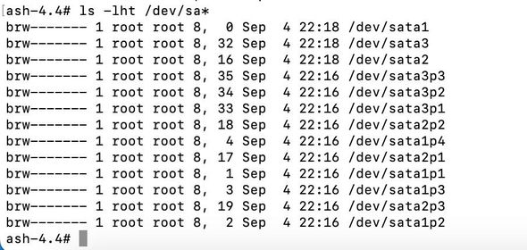
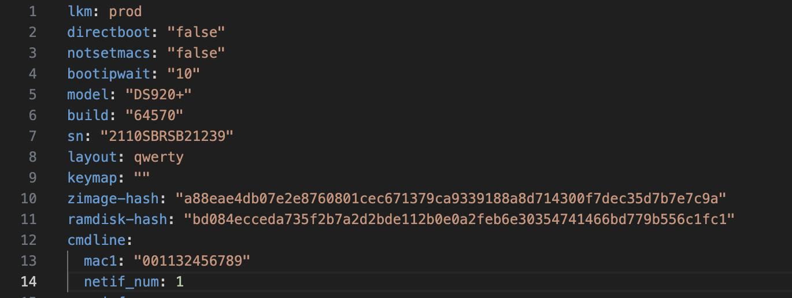

# Change sn/mac DSM
Thay đổi đổi được sn/mac thực cho DSM bằng câu lệnh
Thấy 1 số ace loay hoay mãi mà không đổi được sn/mac nên mình viết bài này ace chịu khó đọc và làm theo nhé.
===========================

===========================
Lưu ý:
+ Phải đúng sn và mac1 thì mới chạy ngon lành được nhé. Nas có nhiều card mạng ace có thể khai báo thêm mac2, mac3, mac4 và thay đổi giá trị key netif_num = số lượng card mạng có trên nas
+ Ace cài xpen trên hệ ảo hoá thì nhớ thay đổi giá trị mac trên card mạng ảo trên OS ảo hoá nhé.

Cách 1: Thay đổi trực tiếp trên TCRP/ARPL Tool
--> Hiện các tool này đều đã hỗ trợ ace điền sn/mac để nhét vào bootloader luôn.
+ Đối với TCRP: ace có thể dùng nano/vi để sửa file user-config.json. Thay đổi các key sn, mac1, netif_num thành giá trị mình gửi
+ Đối với ARPL: ace có thể kiểm tra trên menu của ARPL xem có mục Define custom Serial/Mac address
--> Nếu có thì vào menu này điền sn và mac address rồi build bootloader
---> Nếu không có ace tìm tiếp mục Edit user config file --> tìm các key sn, mac1, netif_num

Cách 2: Đã có sẵn bootloader
Bước 1: Xác định xem phân vùng nào chứa tập tin cấu hình (grub.cfg or user-config.yml)
--> Các bản AIO thì file grub.cfg sẽ nằm trên phần vùng thứ 3 trên usb/ssd
--> Các bản khác sẽ nằm trên phần vùng đầu tiên trên usb/ssd

Bước 2: Chọn cách thức để sửa tập tin cấu hình
--> Phương án 1: Cắm usb/ssd boot vào máy tính dùng window --> tải app Disk Genius --> truy cập vào phân vùng đã xác định ở bước 1 tìm tập tin cấu hình và sửa lại các giá trị tương tự cách 1
--> Phương án 2: NAS đang chạy thì ace chịu khó bật SSH lên rồi SSH vào NAS sau đó chạy các lệnh sau
+ sudo su (điền password để chuyển qua root)
+ cd /dev && mkdir -p /tmp/bl (chuyển vào thư mục dev và tạo thư mục bl)
+ mount synoboot1 /tmp/bl (mount synoboot1 vào /tmp/bl)
+ vi /tmp/bl/user-config.yml (cho ace dùng arpl)
+ vi /tmp/bl/boot/grub/grub.cfg (cho ace dùng tcrp)
+ Dùng 4 phím điều hướng di chuyển con trỏ tìm vị trí key sn, mac1, netif_num
+ Bấm phím i or insert trên bàn phím để chuyển sang chế độ chỉnh sửa
+ Sửa các giá trị xong ace bấm phím ESC rồi gõ :wq để tiến hành lưu
+ umount /tmp/bl (umount /tmp/bl)
+ Reboot nas và check lại thông số trong Control Panel/Info Center

--> Phương án 3: Cho các ace dùng AIO or ko tìm thấy /dev/synoboot1
+ Đi tìm device nào chứa phân vùng bootloader
Gõ 1 trong 2 lệnh sau
ls /dev/sd* -lna hoặc ls /dev/sata* -lna

+ Tìm trên kết quả trả về xem có device nào có 4 phân vùng hay ko?
(hình đính kèm thì sata1 có 4 phân vùng sata1p1 sata1p2 sata1p3 và sata1p4)

+ Thay lệnh mount ở phương án 2 thành đường dẫn đến phân vùng thứ 3 trên ổ ssd/hdd
vd: mount /dev/sata1p3 /tmp/bl

+Thực hiện các bước tiếp theo như phương án 2

Chúc ace thành công.Mọi thắc mắc thì ib mình.Mình sẽ giải đáp khi mình rãnh

=======================================

=======================================
